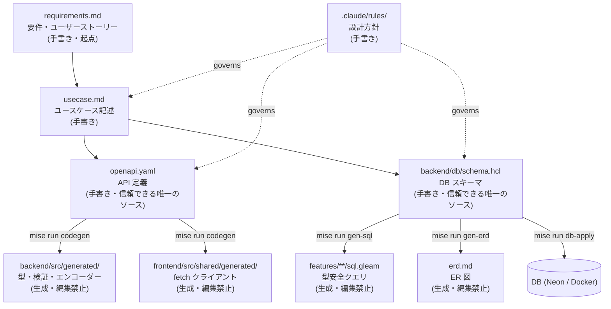

# ドキュメントの地図

このリポジトリのドキュメントと、それらの依存関係（何から派生し、何を生むか）を示す。
個々の内容は各ファイルを参照。**設計方針そのものは `.claude/rules/` にある。**

## 関係図

## 一覧

| ドキュメント | 役割 | 種別 | 派生元 → 派生先 |
|---|---|---|---|
| `requirements.md` | 要件・ユーザーストーリー・ビジネスルール・スコープ | 手書き（起点） | → `usecase.md` |
| `usecase.md` | ユースケース記述（基本/例外フロー・事後条件） | 手書き | `requirements.md` → `openapi.yaml` / `schema.hcl` |
| `openapi.yaml` | API 定義。リクエスト/レスポンスの型・検証・エンコードの唯一のソース | 手書き | → `backend/src/generated/`・`frontend/src/shared/generated/` |
| `backend/db/schema.hcl` | DB スキーマの唯一のソース（Atlas） | 手書き | → `erd.md`・`sql.gleam`・DB |
| `erd.md` | ER 図（Mermaid） | 生成（`mise run gen-erd`） | `schema.hcl` から生成・**編集禁止** |
| `aws-architecture.drawio(.svg)` | インフラ構成図 | 手書き（drawio） | — |
| `aws-iam-cheatsheet.md` | AWS IAM 早見表 | 手書き | — |
| `bruno/` | API 動作確認用コレクション（Bruno） | 手書き | `openapi.yaml` に追従 |
| `.claude/rules/*.md` | 設計方針（集約・バリデーション・SQL・DB・テスト 等） | 手書き | 上記すべての書き方を律する |

## 編集のルール

- **手書きの起点を直す**: 仕様変更は `requirements.md` / `usecase.md`、API 変更は `openapi.yaml`、DB 変更は `schema.hcl` を先に直す
- **生成物は直さない**: `erd.md` / `generated/` / `sql.gleam` は生成物。元を直して再生成する（`mise run codegen`・`gen-erd`）
- **現状の実装ステータス（抜け・TODO）はここに書かない**: ドキュメントは「あるべき仕様」を保つ。未達は `todo` テストで可視化する（`.claude/rules/testing.md`）
</content>
