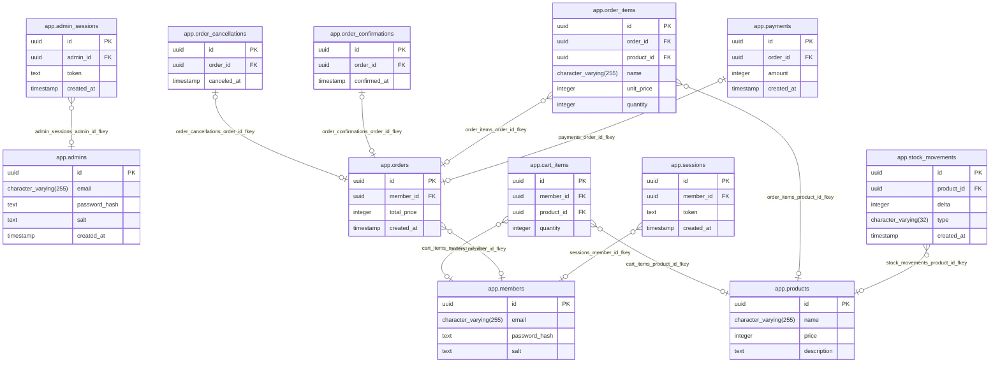

```mermaid
erDiagram
    app_admin_sessions["app.admin_sessions"] {
      uuid id PK
      uuid admin_id FK
      text token
      timestamp created_at
    }
    app_admin_sessions }o--o| app_admins : admin_sessions_admin_id_fkey
    app_admins["app.admins"] {
      uuid id PK
      character_varying(255) email
      text password_hash
      text salt
      timestamp created_at
    }
    app_cart_items["app.cart_items"] {
      uuid id PK
      uuid member_id FK
      uuid product_id FK
      integer quantity
    }
    app_cart_items }o--o| app_members : cart_items_member_id_fkey
    app_cart_items }o--o| app_products : cart_items_product_id_fkey
    app_members["app.members"] {
      uuid id PK
      character_varying(255) email
      text password_hash
      text salt
    }
    app_order_cancellations["app.order_cancellations"] {
      uuid id PK
      uuid order_id FK
      timestamp canceled_at
    }
    app_order_cancellations |o--o| app_orders : order_cancellations_order_id_fkey
    app_order_confirmations["app.order_confirmations"] {
      uuid id PK
      uuid order_id FK
      timestamp confirmed_at
    }
    app_order_confirmations |o--o| app_orders : order_confirmations_order_id_fkey
    app_order_items["app.order_items"] {
      uuid id PK
      uuid order_id FK
      uuid product_id FK
      character_varying(255) name
      integer unit_price
      integer quantity
    }
    app_order_items }o--o| app_orders : order_items_order_id_fkey
    app_order_items }o--o| app_products : order_items_product_id_fkey
    app_orders["app.orders"] {
      uuid id PK
      uuid member_id FK
      integer total_price
      timestamp created_at
    }
    app_orders }o--o| app_members : orders_member_id_fkey
    app_payments["app.payments"] {
      uuid id PK
      uuid order_id FK
      integer amount
      timestamp created_at
    }
    app_payments |o--o| app_orders : payments_order_id_fkey
    app_products["app.products"] {
      uuid id PK
      character_varying(255) name
      integer price
      text description
    }
    app_sessions["app.sessions"] {
      uuid id PK
      uuid member_id FK
      text token
      timestamp created_at
    }
    app_sessions }o--o| app_members : sessions_member_id_fkey
    app_stock_movements["app.stock_movements"] {
      uuid id PK
      uuid product_id FK
      integer delta
      character_varying(32) type
      timestamp created_at
    }
    app_stock_movements }o--o| app_products : stock_movements_product_id_fkey
```
